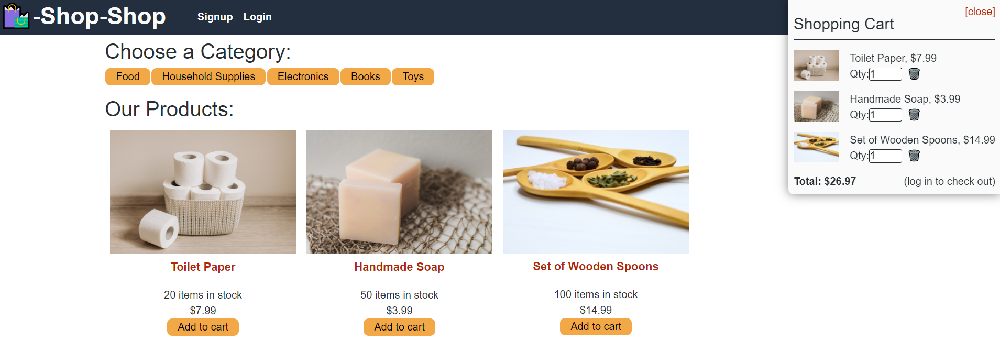

  # Shop-Shop Redux Implementation 
  
  ## Description
  A e-commerce shop refactored to incorporate Redux to manage State.

  ## Table of Contents
  * [Installation](#installation)
  * [Usage](#usage)
  * [Contributions](#contributions)
  * [Tests](#tests)
  * [Questions](#questions)

  ## Installation
  Visit the site and enjoy.

  ## Usage
  Use Redux to seamlessly manage the state of your online shop.

  ## Screenshot(s)
  

  ## Deployed Heroku App
  

  ## Contributions
  [BenPaulat](https://github.com/BenPaulat)

  ## Tests
  npm test

  ## Questions
  [BenPaulat](https://github.com/BenPaulat)
  benjamin.d.paulat@gmail.com

